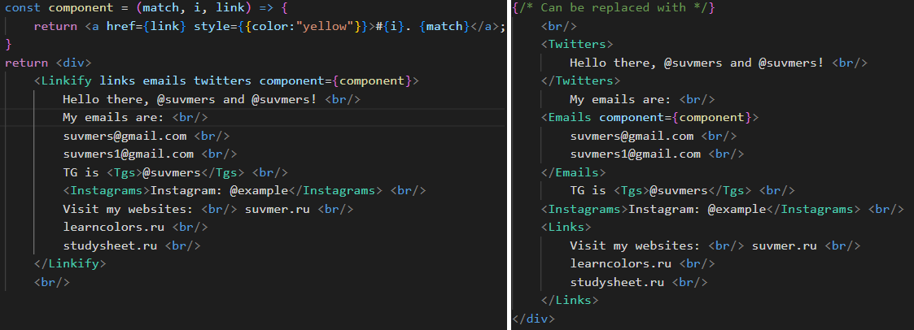

# react-linkify-all
- [Preview](#preview)
- [Description](#description)
- [Installation](#installation)
- [Basic Usage](#basic-usage)
- [Own components and patterns](#own-components-and-patterns)
- [Example with linkify() method](#example-with-linkify-method)
- [Contacts](#contacts)

## Preview
Try it on CodeSandBox: https://codesandbox.io/s/compassionate-meitner-y8d9l9

Popup functionality:


Code:


## Description

Modal pop up on hover, clickable links in text - everything is here. This is NPM package that converts text with links into an array of React components. Customizable. Built-in support of emails, Telegram, Twitter mentions. Modal pop up can be implemented as it shown above. Own pattern can be used to linkify everything

## Installation
```sh
npm i react-linkify-all
```
## Basic Usage
```jsx
import { Linkify } from 'react-linkify-all'
...
<Linkify links twitters emails>Some text with links.net, @twitters and emails@domain.org</Linkify>
```
Available props: *emails, instagrams, links, tgs, twitters*  
And their corresponding components: ```<Emails/>, <Instagrams/>, <Links/>, <Tgs/>, <Twitters/>```  

Also you can use method ```linkify()``` to linkify(an example is given below).

### Example with react components:


Code:


Result HTML:


**Nesting is not supported yet:** use ``` <Linkify links twitters emails... /> ``` to summarize effects

## Own components and patterns
You could use your own component for links:
```jsx
const component = (match, i, link) => {
    return <a href={link} style={{color:"yellow"}}>#{i}. {match}</a>;
}
...
<Linkify ... component={component}>...</Linkify>
```
The "i" parameter can be used to number links(there is a counter for each type of link)
Parameters "match" and "link" may differ.

**Example #1:**
```jsx
<Links>site.com</Links>
```
**match**: site.com  
**link**: https://site.com  
**i**: 1  

### Creating own patterns
Every pattern for linkify is set by an object:
```jsx
const option = {
    regex: RegExp, //          /(...)/g,
    component?: (match, i, link) => ReactElement,
    linkFn?: (match:string) => string
}
```
**WARNING:** be sure to put parentheses around the regular expression. In addition, every internal capturing group should be not captured. RegEx should capture only the entrie word you need.

The default component is:
```jsx
const defaultComponent = (match, i, link) => <a href={link}>{match}</a>;
```
"linkFn" is a function for converting a match into a link.
In **Example #1** above, linkFn is:
```js
const example = match => match.substring(0, 4) === 'http' ? match : 'https://'+match
```
(It is used to handle matches like site.com and https://site.com)
### Using own patterns
```jsx
const option = {
    regex: new RegExp("((?<=\\B)@[a-zA-Z0-9_]{5,32}(?=\\b))", "g"),
    component: (match, i, link) => <a href={link}>{match}</a>,
    linkFn: match => "https://twitter.com/"+match.substring(1)
  };
...
<Linkify options={option}>...</Linkify>
```
This example will wrap every Twitter profile mention into <a\/\> tag.

Also, you can combine options:

```jsx
<Linkify options={[option1, option2, ..., optionN]}>...</Linkify>
```

They will be applied consistently

## Example with linkify() method
```jsx
import { linkify } from 'react-linkify-all';
...
const Card = (text) => {
    const option = ...;
    const result = linkify(text, option);
    return <div>{result}</div>;
}
```

# Contacts
If you find react-linkify-all to be useful in your project, please consider to star and support it: https://github.com/suvmer/react-linkify-all  
If you want to contact me, send an email to suvmers@gmail.com  
I'm also available on Telegram: https://t.me/suvmers
